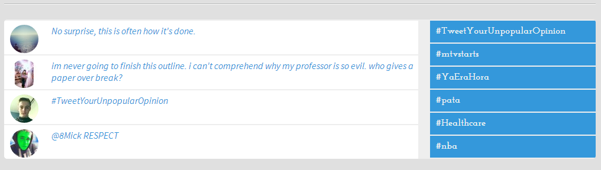

[Lab 1 - Web Systems review(-ish): HTML5, CSS3, JavaScript, JSON]{.c11}

[]{.c2}

[Due: Friday, January 20, before class.]{.c4}[Whatever is on GitHub at
that time will be graded.]{.c9 .c4}[Committing after the due date will
result in the lab being marked late!]{.c5 .c9 .c4 .c10}

[]{.c2}

T[his should help get your brain to think in code again, and perhaps
spur some ideas for your projects.]{.c2}

[]{.c2}

[A long time ago (in a galaxy far far away...), we made a Tweet ticker
for Lab 1. I provided pre-scraped Tweets in JSON format. But they're old
now, and mostly broken. We can do better.]{.c2}

[]{.c2}

[We are going to create a news ticker. You will still be using
pre-scraped data, but it will be up to you from where you will scrape
that data. Yes, you may use multiple news sites. Many news sites have an
RSS feed, which will give you XML descriptions of news articles. I bet
there are some free tools out there that can convert XML to JSON if
you'd like to make your life easier and parse JSON for your
labs...]{.c2}

[]{.c2}

You should aim to scrape [at least 200 articles]{.c4} for the lab. This
may take several news sites to accomplish. Again, that's fine.
Concatenate all the news items into a single JSON (or XML) file. If
using JSON, you should run your finalized JSON file through a JSON
linter:
[[https://jsonlint.com/](https://www.google.com/url?q=https://jsonlint.com/&sa=D&source=editors&ust=1673720541233797&usg=AOvVaw1FrmdraMTL1i63GJKMMDi4){.c8}]{.c5
.c6}

[]{.c2}

Need a refresher on JSON? Find the official documentation here:
[[https://json.org/](https://www.google.com/url?q=https://json.org/&sa=D&source=editors&ust=1673720541234312&usg=AOvVaw2JDUnkPh5sWZ3Q_ZYBAcaz){.c8}]{.c5
.c6}

[]{.c2}

Like I mentioned before, you get to use all the fancy things right from
the beginning now. Bootstrap would be quite handy for this lab. Read up
on its documentation here:
[[https://getbootstrap.com/](https://www.google.com/url?q=https://getbootstrap.com/&sa=D&source=editors&ust=1673720541234751&usg=AOvVaw1S4BDolN6B5M8yAvxvlidk){.c8}]{.c5
.c6}

[]{.c2}

[Use your VM to host your site. Don't have a VM yet? I am working on it!
For now, you can install XAMPP to your local machine and use that.]{.c2}

[]{.c2}

[You may not use PHP for this lab!]{.c4}[ You can (and must) use HTML,
CSS, and JavaScript. Nothing else!]{.c2}

[]{.c2}

You will [design]{.c5} this app together as a group and devise some sort
of specification guide together. After that, each of you will
[individually]{.c5}[ implement those things specified in the
specification guide. So yes, it might be the case that each of your apps
look and feel very similar. That's fine. The goal is to get you working
together as a group for the first time (not unlike your resume lab last
semester).]{.c2}

[]{.c2}

[The lab:]{.c4}

[Create a news ticker, which will show the news items from the JSON
file, five articles at a time. The ticker must slowly cycle through the
articles no faster than once every three seconds. How you choose to
cycle is up to you: you could replace all five articles every three
seconds, replace one every three seconds, or anything in between.]{.c2}

[]{.c2}

[Use CSS3 transitions and animations (or jQuery animations, if you
prefer) to make the articles cycle through the ticker smoothly.]{.c2}

[]{.c2}

[Make the site responsive and clean using Bootstrap. Ideally, it should
look good on both desktop and mobile. Remember the dev tools built into
Chrome and Firefox! There are buttons that squeeze everything down to
phone-screen size. Things like \@media-queries might be useful to
getting everything right (if you're not going to go the Bootstrap
route).]{.c2}

[]{.c2}

Please write a README.md file that documents your thinking throughout
the development process. I want to know where you got stuck, how you got
unstuck, what was easy, what was difficult, etc. You should also
document your individual creativity there. Remember too that you're
allowed to use tutorials and open source code if you want, but those
things have to be cited in the README.md file. Additionally, open source
code needs to actually follow the terms of the license (this usually
means including an [unmodified copy of the license]{.c4} somewhere in
your repo--[it is against the law to modify someone else's license in
any way, for any reason]{.c5}[).]{.c2}

[]{.c2}

[You must put a copy of the specification guide in your README.md file.
That way I can be sure everyone in the group used the same one ]{.c2}

[]{.c2}

Did you remember to invite me and the TA to your private lab repo? We
can't grade what we don't have access to.

[]{.c2}

[Potential example (from back when this was a Tweet ticker):]{.c4 .c7}

[{style="width: 624.00px; height: 177.33px; margin-left: 0.00px; margin-top: 0.00px; transform: rotate(0.00rad) translateZ(0px); -webkit-transform: rotate(0.00rad) translateZ(0px);"}]{style="overflow: hidden; display: inline-block; margin: 0.00px 0.00px; border: 0.00px solid #000000; transform: rotate(0.00rad) translateZ(0px); -webkit-transform: rotate(0.00rad) translateZ(0px); width: 624.00px; height: 177.33px;"}

[Remember: if you copy this exactly, you get a C. Creativity is key!
Study other news ticker apps out there: see what you like and what you
don't (and then cite the news ticker apps you studied in your README.md
file!).]{.c2}

[]{.c2}

[Grading rubric:]{.c7 .c4}

[Formatting and code style:                10 points]{.c2}

[Objective 1, processing JSON/XML:        10 points]{.c2}

[Objective 2, displaying output:        10 points]{.c2}

[Creativity:                                10 points]{.c2}

[README.md:                                10 points]{.c2}

[Total:                                        50 points]{.c7 .c4}

[]{.c7 .c4}

[Extra credit]{.c4}

For an additional 5 points, use API calls to get your news items. [Do
not use any APIs that cost money!!!]{.c4 .c9}
