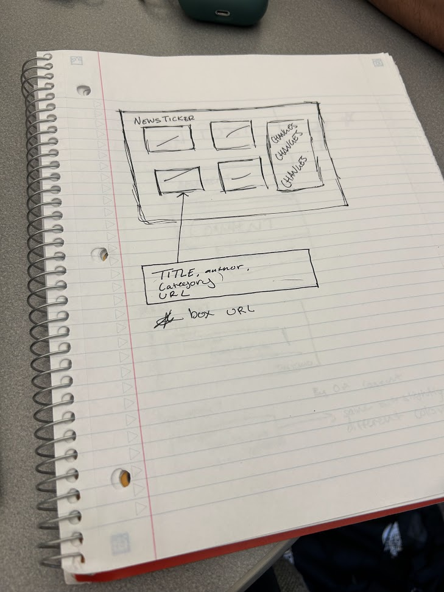

# Lab-1 | Specification Sheet


## Product
-   A news website that displays current tech news.
-   The main feature is a grid/ist of cards, the one in current focus
    is indicated


## Resources
-   [HackerNews](https://news.ycombinator.com/)
-   [HackerNews API](https://github.com/HackerNews/API)
-   In the API: title, by, url (possibly), and Type

## Backend
-   [https://hacker-news.firebaseio.com/v0/topstories.json?print=pretty](https://www.google.com/url?q=https://hacker-news.firebaseio.com/v0/topstories.json?print%3Dpretty)
-   [https://hacker-news.firebaseio.com/v0/item/8863.json?print=pretty](https://www.google.com/url?q=https://hacker-news.firebaseio.com/v0/item/8863.json?print%3Dpretty)


## Wireframe
```
------------------------------------------------------------------------+
| <Article Title\> (Link)                                               |
|                                                                       |
|                                                                       |
| [By: \<User\>     Score: \<Score\>]                                   |
+-----------------------------------------------------------------------+
| [\<Article Title\> (Link)]                                            |
|                                                                       |
|                                                                       |
| [By: \<User\>     Score: \<Score\>]                                   |
+-----------------------------------------------------------------------+
| [\<Article Title\> (Link)]                                            |
|                                                                       |
|                                                                       |
| [By: \<User\>     Score: \<Score\>]                                   |
+-----------------------------------------------------------------------+
```
-   See Exhibit A


# Exhibits: 


## A:

[{style="width: 313.45px; height: 418.50px; margin-left: 0.00px; margin-top: 0.00px; transform: rotate(0.00rad) translateZ(0px); -webkit-transform: rotate(0.00rad) translateZ(0px);"}]{style="overflow: hidden; display: inline-block; margin: 0.00px 0.00px; border: 0.00px solid #000000; transform: rotate(0.00rad) translateZ(0px); -webkit-transform: rotate(0.00rad) translateZ(0px); width: 313.45px; height: 418.50px;"}

[Wireframe for an idea for the NewsTicker]{.c0}
